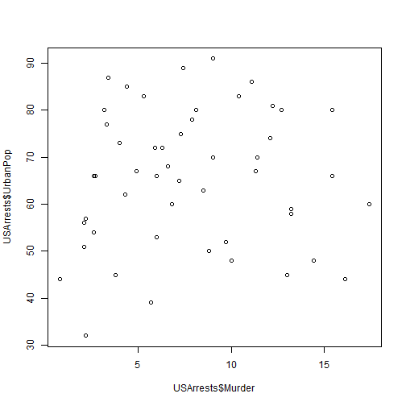
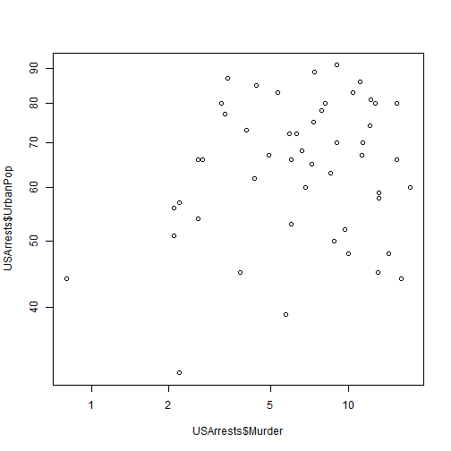
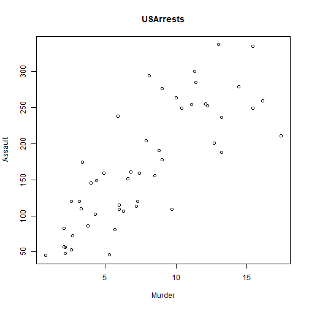
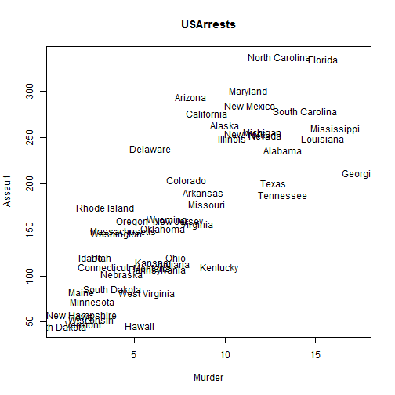
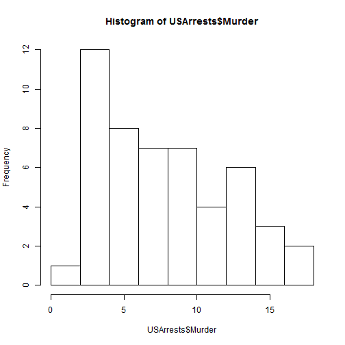
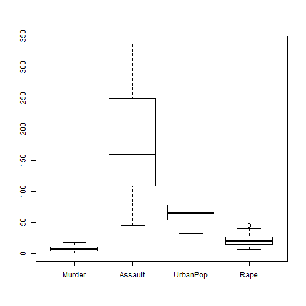

Demo 1 R basics
========================================================


```r
# Demo 1 install R, R studio, and NodeXL

######################## R basics

# get work directory
getwd()
```

```
## [1] "E:/Github/demo1_install_softwares"
```

```r
setwd("E:/github/ergm/")  # modify here to set your work directory


1 + 3  # evaluation
```

```
## [1] 4
```

```r
a = 3  # assignment
a  # evaluation
```

```
## [1] 3
```

```r
a = 3  # spacing does not matter
sqrt(a)  # use the square root function
```

```
## [1] 1.732
```

```r
b = sqrt(a)
b  # use function and save result
```

```
## [1] 1.732
```

```r


help(sqrt)  # get specific help for a function
```

```
## starting httpd help server ... done
```

```r
`?`(sqrt  # get specific help for a function
)

a == b  # Using two equals sign to judge whether a is equivalent to b. 
```

```
## [1] FALSE
```

```r
a != b  # is a not equal to b?
```

```
## [1] TRUE
```

```r

############################## Vectors and matrices in R

# create a vector by combining values
a = c(1, 3, 5)
a
```

```
## [1] 1 3 5
```

```r
a[2]  # select the second element
```

```
## [1] 3
```

```r
b = c("one", "three", "five")
b  # also works with strings
```

```
## [1] "one"   "three" "five"
```

```r
b[2]
```

```
## [1] "three"
```

```r
a = c(a, a)
a  # can apply recursively
```

```
## [1] 1 3 5 1 3 5
```

```r
a = c(a, b)
a  # mixing types---what happens?
```

```
## [1] "1"     "3"     "5"     "1"     "3"     "5"     "one"   "three" "five"
```

```r

## Sequences and replication
a = seq(from = 1, to = 5, by = 1)  # from 1 to 5 the slow way
b = 1:5  # a shortcut!
a == b  # all TRUE
```

```
## [1] TRUE TRUE TRUE TRUE TRUE
```

```r
rep(1, times = 5)  # a lot of ones
```

```
## [1] 1 1 1 1 1
```

```r
rep(1:5, times = 2)  # repeat an entire sequence
```

```
##  [1] 1 2 3 4 5 1 2 3 4 5
```

```r
rep(1:5, each = 2)  # same, but element-wise
```

```
##  [1] 1 1 2 2 3 3 4 4 5 5
```

```r
rep(1:5, times = 5:1)  # can vary the count of each element
```

```
##  [1] 1 1 1 1 1 2 2 2 2 3 3 3 4 4 5
```

```r

## matrices
a = matrix(data = 1:25, nrow = 5, ncol = 5)
a  # create a matrix the 'formal' way
```

```
##      [,1] [,2] [,3] [,4] [,5]
## [1,]    1    6   11   16   21
## [2,]    2    7   12   17   22
## [3,]    3    8   13   18   23
## [4,]    4    9   14   19   24
## [5,]    5   10   15   20   25
```

```r
a[1, 2]  # select a matrix element (two dimensions)
```

```
## [1] 6
```

```r
a[1, ]  # just the first row
```

```
## [1]  1  6 11 16 21
```

```r
a[, 2]  # can also perform for columns
```

```
## [1]  6  7  8  9 10
```

```r
a[2:3, 3:5]  # select submatrices
```

```
##      [,1] [,2] [,3]
## [1,]   12   17   22
## [2,]   13   18   23
```

```r
a[-1, ]  # get rid of row one
```

```
##      [,1] [,2] [,3] [,4] [,5]
## [1,]    2    7   12   17   22
## [2,]    3    8   13   18   23
## [3,]    4    9   14   19   24
## [4,]    5   10   15   20   25
```

```r

# create matrices by combining rows or columns
b = cbind(1:5, 1:5)
b
```

```
##      [,1] [,2]
## [1,]    1    1
## [2,]    2    2
## [3,]    3    3
## [4,]    4    4
## [5,]    5    5
```

```r
d = rbind(1:5, 1:5)
d  # can perform with rows, too
```

```
##      [,1] [,2] [,3] [,4] [,5]
## [1,]    1    2    3    4    5
## [2,]    1    2    3    4    5
```

```r

dim(b)  # dimensions = number of rows * number of columns
```

```
## [1] 5 2
```

```r
nrow(b)  # the number of rows
```

```
## [1] 5
```

```r
ncol(b)  # the number of columns
```

```
## [1] 2
```

```r

# Element-wise operations
a = 1:5
a + 1  # addition
```

```
## [1] 2 3 4 5 6
```

```r
a * 2  # multiplication
```

```
## [1]  2  4  6  8 10
```

```r
a/3  # division
```

```
## [1] 0.3333 0.6667 1.0000 1.3333 1.6667
```

```r
a - 4  # subtraction
```

```
## [1] -3 -2 -1  0  1
```

```r
a^5  # the 5th power
```

```
## [1]    1   32  243 1024 3125
```

```r
a + a  # also works on pairs of vectors
```

```
## [1]  2  4  6  8 10
```

```r
a * a
```

```
## [1]  1  4  9 16 25
```

```r
log(a)
```

```
## [1] 0.0000 0.6931 1.0986 1.3863 1.6094
```

```r
exp(b)
```

```
##         [,1]    [,2]
## [1,]   2.718   2.718
## [2,]   7.389   7.389
## [3,]  20.086  20.086
## [4,]  54.598  54.598
## [5,] 148.413 148.413
```

```r

################# Data frames

d = data.frame(income = 1:5, health = c(T, T, T, T, F), name = LETTERS[1:5])
d
```

```
##   income health name
## 1      1   TRUE    A
## 2      2   TRUE    B
## 3      3   TRUE    C
## 4      4   TRUE    D
## 5      5  FALSE    E
```

```r
d[1, 2]  # acts a lot like a matrix!
```

```
## [1] TRUE
```

```r
d[, 1] * 5
```

```
## [1]  5 10 15 20 25
```

```r
d[-1, ]
```

```
##   income health name
## 2      2   TRUE    B
## 3      3   TRUE    C
## 4      4   TRUE    D
## 5      5  FALSE    E
```

```r
d$health  # can use dollar sign notation 
```

```
## [1]  TRUE  TRUE  TRUE  TRUE FALSE
```

```r
d$health[3] = FALSE  # making changes
d
```

```
##   income health name
## 1      1   TRUE    A
## 2      2   TRUE    B
## 3      3  FALSE    C
## 4      4   TRUE    D
## 5      5  FALSE    E
```

```r
d[2, 3]  # shows factors for string values
```

```
## [1] B
## Levels: A B C D E
```

```r
d$name = LETTERS[1:5]  # eliminate evil factors by overwriting
d[2, 3]
```

```
## [1] "B"
```

```r

# avoid to use factors (if you want)
d = data.frame(income = 1:5, health = c(T, T, T, T, F), name = LETTERS[1:5], 
    stringsAsFactors = FALSE)
d
```

```
##   income health name
## 1      1   TRUE    A
## 2      2   TRUE    B
## 3      3   TRUE    C
## 4      4   TRUE    D
## 5      5  FALSE    E
```

```r
d = as.data.frame(cbind(1:5, 2:6))  # can create from matrices
d
```

```
##   V1 V2
## 1  1  2
## 2  2  3
## 3  3  4
## 4  4  5
## 5  5  6
```

```r
is.data.frame(d)  # how can we tell it's not a matrix?
```

```
## [1] TRUE
```

```r
is.matrix(d)  # the truth comes out
```

```
## [1] FALSE
```

```r


# Finding built-in data sets Many packages have built-in data for testing
# and educational purposes

data()  # lists them all
`?`(USArrests  # get help on a data set
)
data(USArrests)  # load the data set
USArrests  # view the object
```

```
##                Murder Assault UrbanPop Rape
## Alabama          13.2     236       58 21.2
## Alaska           10.0     263       48 44.5
## Arizona           8.1     294       80 31.0
## Arkansas          8.8     190       50 19.5
## California        9.0     276       91 40.6
## Colorado          7.9     204       78 38.7
## Connecticut       3.3     110       77 11.1
## Delaware          5.9     238       72 15.8
## Florida          15.4     335       80 31.9
## Georgia          17.4     211       60 25.8
## Hawaii            5.3      46       83 20.2
## Idaho             2.6     120       54 14.2
## Illinois         10.4     249       83 24.0
## Indiana           7.2     113       65 21.0
## Iowa              2.2      56       57 11.3
## Kansas            6.0     115       66 18.0
## Kentucky          9.7     109       52 16.3
## Louisiana        15.4     249       66 22.2
## Maine             2.1      83       51  7.8
## Maryland         11.3     300       67 27.8
## Massachusetts     4.4     149       85 16.3
## Michigan         12.1     255       74 35.1
## Minnesota         2.7      72       66 14.9
## Mississippi      16.1     259       44 17.1
## Missouri          9.0     178       70 28.2
## Montana           6.0     109       53 16.4
## Nebraska          4.3     102       62 16.5
## Nevada           12.2     252       81 46.0
## New Hampshire     2.1      57       56  9.5
## New Jersey        7.4     159       89 18.8
## New Mexico       11.4     285       70 32.1
## New York         11.1     254       86 26.1
## North Carolina   13.0     337       45 16.1
## North Dakota      0.8      45       44  7.3
## Ohio              7.3     120       75 21.4
## Oklahoma          6.6     151       68 20.0
## Oregon            4.9     159       67 29.3
## Pennsylvania      6.3     106       72 14.9
## Rhode Island      3.4     174       87  8.3
## South Carolina   14.4     279       48 22.5
## South Dakota      3.8      86       45 12.8
## Tennessee        13.2     188       59 26.9
## Texas            12.7     201       80 25.5
## Utah              3.2     120       80 22.9
## Vermont           2.2      48       32 11.2
## Virginia          8.5     156       63 20.7
## Washington        4.0     145       73 26.2
## West Virginia     5.7      81       39  9.3
## Wisconsin         2.6      53       66 10.8
## Wyoming           6.8     161       60 15.6
```

```r

############################# Elementary visualization

## R's workhorse is the ``plot' command

plot(USArrests$Murder, USArrests$UrbanPop)  # using dollar sign notation
```

 

```r
plot(USArrests$Murder, USArrests$UrbanPop, log = "xy")  # log-log scale
```

 

```r

## Adding plot title and axis labels

plot(USArrests$Murder, USArrests$Assault, xlab = "Murder", ylab = "Assault", 
    main = "USArrests")
```

 

```r

## Can also add text
plot(USArrests$Murder, USArrests$Assault, xlab = "Murder", ylab = "Assault", 
    main = "USArrests", type = "n")
text(USArrests$Murder, USArrests$Assault, rownames(USArrests))
```

 

```r

## Histograms and boxplots
hist(USArrests$Murder)
```

 

```r
boxplot(USArrests)
```

 


