Simulate networks and fit the power law distribution
========================================================


```r
# install.packages('igraph')


library(igraph)
size = 50

# tree graph with two children for each node
g = graph.tree(size, children = 2)
plot(g)
```

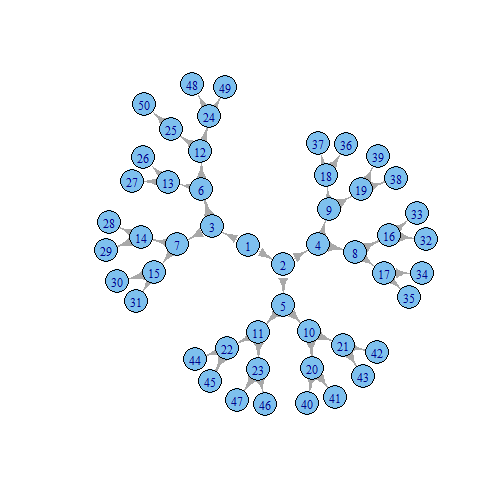 

```r
# star network
g = graph.star(size)
plot(g)
```

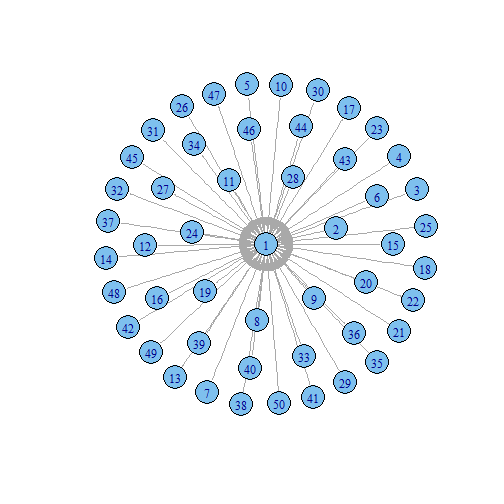 

```r
# full network
g = graph.full(size)
plot(g)
```

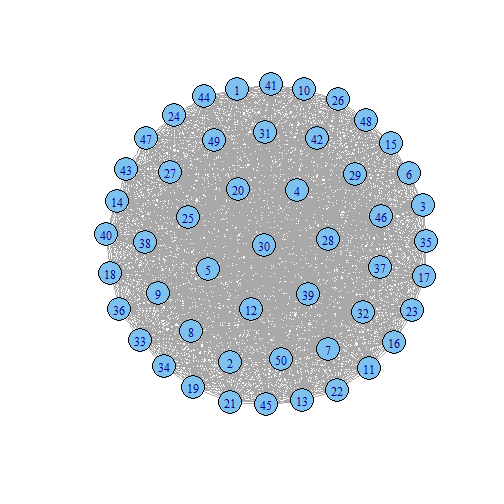 

```r
# ring network
g = graph.ring(size)
plot(g)
```

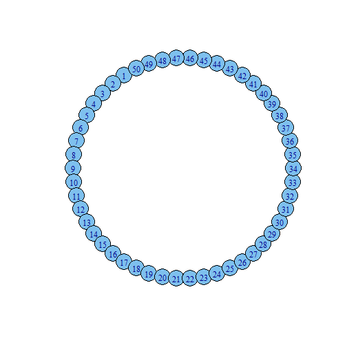 

```r
# connect the node with the vertices not farther than a given limit
g = connect.neighborhood(graph.ring(size), 4)
plot(g)
```

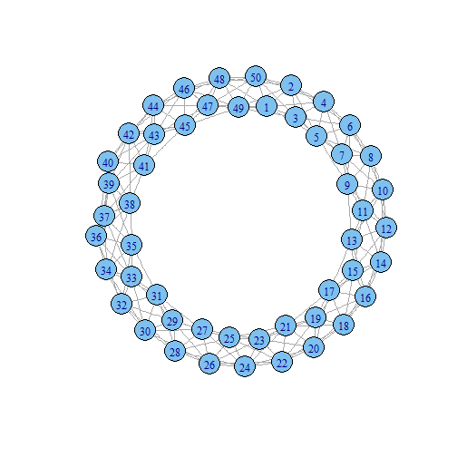 

```r

# random network
g = erdos.renyi.game(size, 0.1)
plot(g)
```

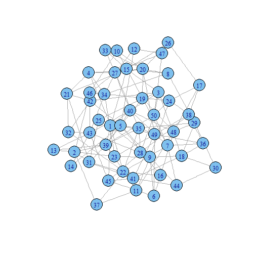 

```r

# small-world network
g = rewire.edges(erdos.renyi.game(size, 0.1), prob = 0.8)
plot(g)
```

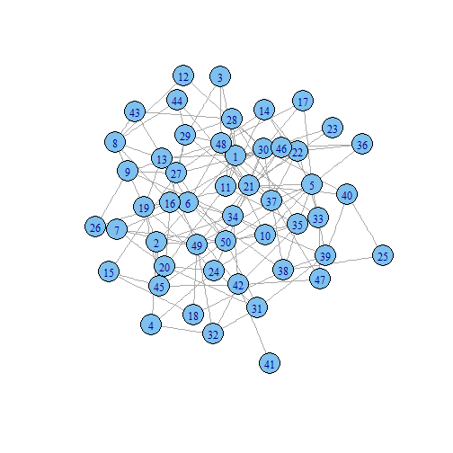 

```r
# scale-free network
g = barabasi.game(size)
plot(g)
```

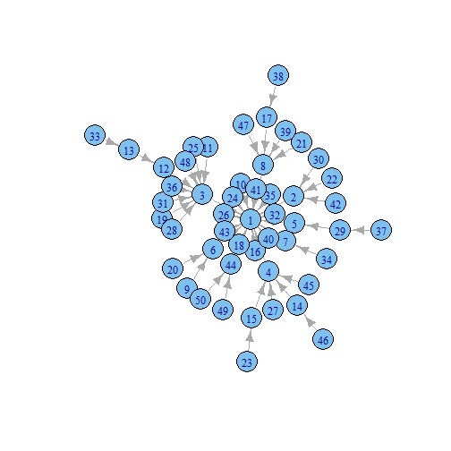 

```r

# degree and degree distribution
d = degree(g, mode = "all")
hist(d)
```

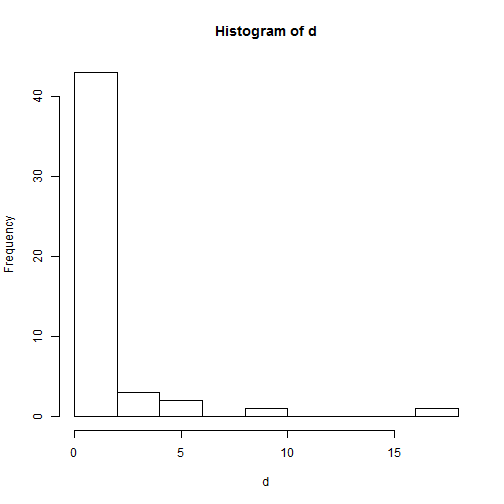 

```r
dd = degree.distribution(g, mode = "all", cumulative = FALSE)

# Plot degree distribution

# write a function to plot the degree distribution
plot_degree_distribution = function(graph) {
    # calculate degree
    d = degree(graph, mode = "all")
    dd = degree.distribution(graph, mode = "all", cumulative = FALSE)
    degree = 1:max(d)
    probability = dd[-1]
    # delete blank values
    nonzero.position = which(probability != 0)
    probability = probability[nonzero.position]
    degree = degree[nonzero.position]
    # plot
    plot(probability ~ degree, log = "xy", xlab = "Degree (log)", ylab = "Probability (log)", 
        col = 1, main = "Degree Distribution")
}


plot_degree_distribution(g)
```

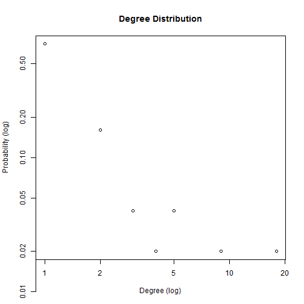 

```r

g.big.ba = barabasi.game(2000)
g.big.er = erdos.renyi.game(2000, 0.1)

plot_degree_distribution(g.big.ba)
```

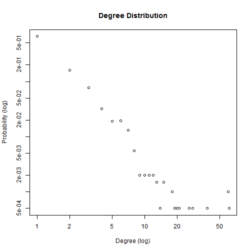 

```r
plot_degree_distribution(g.big.er)
```

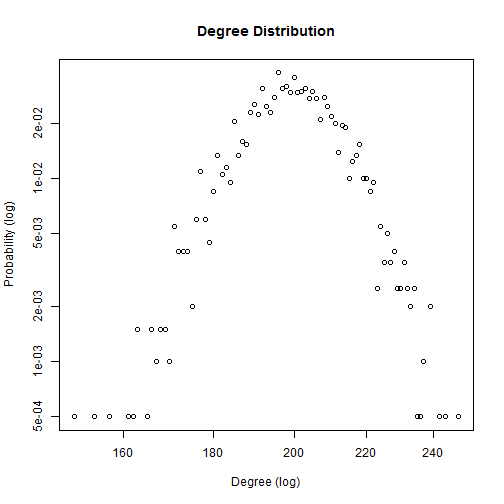 

```r


# plot and fit the power law distribution
fit_power_law = function(graph) {
    # calculate degree
    d = degree(graph, mode = "all")
    dd = degree.distribution(graph, mode = "all", cumulative = FALSE)
    degree = 1:max(d)
    probability = dd[-1]
    # delete blank values
    nonzero.position = which(probability != 0)
    probability = probability[nonzero.position]
    degree = degree[nonzero.position]
    reg = lm(log(probability) ~ log(degree))
    cozf = coef(reg)
    power.law.fit = function(x) exp(cozf[[1]] + cozf[[2]] * log(x))
    alpha = -cozf[[2]]
    R.square = summary(reg)$r.squared
    print(paste("Alpha =", round(alpha, 3)))
    print(paste("R square =", round(R.square, 3)))
    # plot
    plot(probability ~ degree, log = "xy", xlab = "Degree (log)", ylab = "Probability (log)", 
        col = 1, main = "Degree Distribution")
    curve(power.law.fit, col = "red", add = T, n = length(d))
}


fit_power_law(g.big.ba)
```

```
## [1] "Alpha = 1.925"
## [1] "R square = 0.858"
```

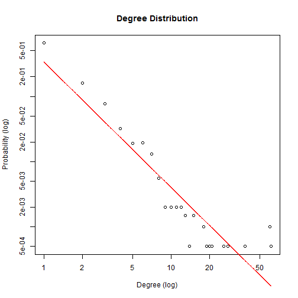 


