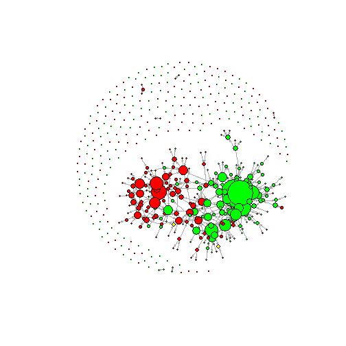
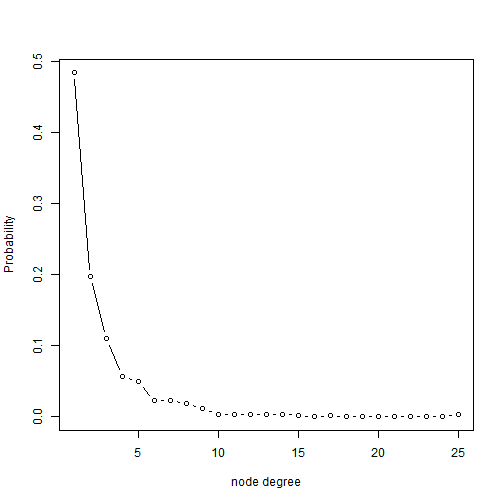
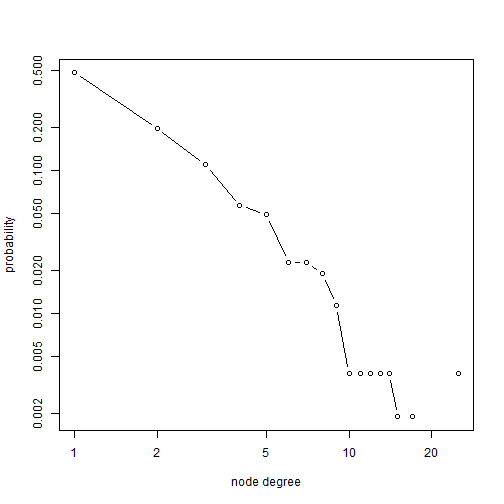
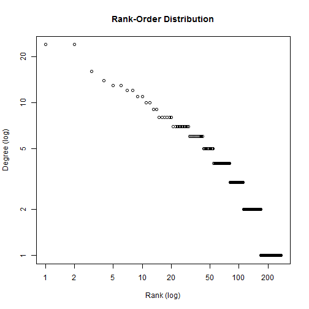
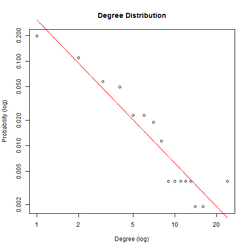
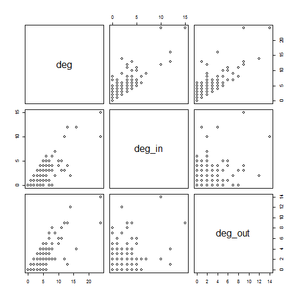
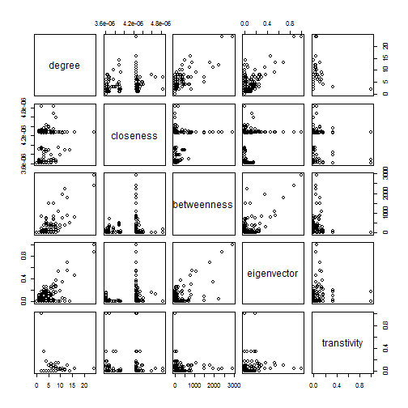
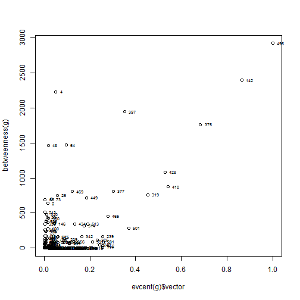
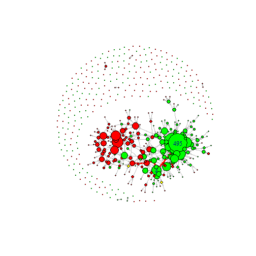
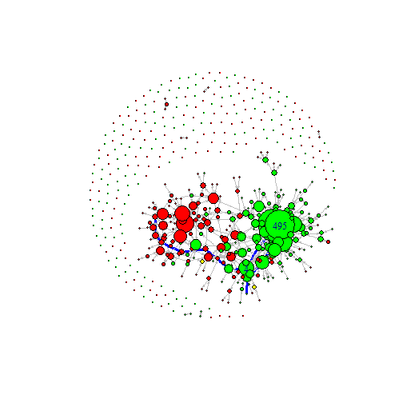

Demo 3. Describe the Network
========================================================
# chengjun wang @ Tencent 2014/04/16


```r
# Describe the congressmen's retweet network with R chengjun wang @ Tencent
# 2014/04/16


library(igraph)
# detach('package:igraph', unload=TRUE) detach('package:statnet',
# unload=TRUE)

setwd("E:/Github/ergm")  # change here to your work directory
att = read.table("./party_info.txt", sep = ",", header = T, stringsAsFactors = F)
mat = as.matrix(read.table("./retweet_network.txt", header = TRUE, sep = ",", 
    row.names = 1, stringsAsFactors = F, as.is = TRUE))
table(att$party)  # democracy, independent, and republic.
```

```
## 
##   D   I   R 
## 251   2 274
```

```r

g = graph.adjacency(mat, mode = c("directed"), weighted = TRUE, diag = FALSE)
g
```

```
## IGRAPH DNW- 527 426 -- 
## + attr: name (v/c), weight (e/n)
```

```r
V(g)$name = colnames(mat)
# edgelist = data.frame( get.edgelist(g, names = T) , stringsAsFactors =
# FALSE)

set.seed(2010)
lay = layout.fruchterman.reingold(g)
V(g)$party = att$party[match(V(g)$name, att$id)]

V(g)$color[V(g)$party == "D"] = "red"
V(g)$color[V(g)$party == "R"] = "green"
V(g)$color[V(g)$party == "I"] = "yellow"
V(g)$size = (degree(g) + 1)
plot(g, layout = lay, vertex.size = V(g)$size, edge.arrow.size = 0.2, vertex.label = NA, 
    vertex.size = 3)
```

 

```r

################# Graph Statistics No of nodes
length(V(g))
```

```
## [1] 527
```

```r
# No of edges
length(E(g))
```

```
## [1] 426
```

```r
# Density (No of edges / possible edges)
graph.density(g)
```

```
## [1] 0.001537
```

```r
# Number of islands
clusters(g)$no
```

```
## [1] 262
```

```r
# Global cluster coefficient: (close triplets/all triplets)
transitivity(g, type = "global")
```

```
## [1] 0.0624
```

```r
# Reciprocity of the graph
reciprocity(g)
```

```
## [1] 0.1268
```

```r

# Connected Component algorithms is to find the island of nodes that are
# interconnected with each other, in other words, one can traverse from one
# node to another one via a path.

# Notice that connectivity is symmetric in undirected graph.Therefore in
# directed graph, there is a concept of 'strong' connectivity which means
# both nodes are considered connected only when it is reachable in both
# direction.

# A 'weak' connectivity means nodes are connected

# Nodes reachable from node4
subcomponent(g, 4, mode = "out")
```

```
##  [1]   4   9  10  22  31  48  64  73  79  92  18  87 397  36  57 100  54
## [18] 142 342 434 473 514  45  77  66  89  30 121 151 184 224 307 377 410
## [35] 428 495  25  85  75 465 209 452  11   3  68 390 146 375 319 162 281
## [52] 301 426 469 480 501 239 275 418 513  76 166 392 449 462 337 356  58
## [69] 233 385 355 329  23  26 217   2  53  27  33  50  81  99  37
```

```r
# Nodes who can reach node4
subcomponent(g, 4, mode = "in")
```

```
##  [1]   4  48  60 469   2  65 495   7  23  26  63 213 290 142 249 281 326
## [18] 374 375 428 452 511 516  53  76 199 241 449 296 359 191  96 114 204
## [35] 297 299 377 381 392 397 465 481 501 254 334 506 153 378 410 319 356
## [52] 488 513 514  71 146 352 261 482 370 239 470  64 434 162 244 382 390
## [69] 475 106 171 292 324 337 466 166 209 167 309 303  75 224 240
```

```r

clusters(g, mode = "weak")
```

```
## $membership
##   [1]   1   1   1   1   2   3   1   1   1   1   1   4   1   1   1   5   6
##  [18]   1   7   1   8   1   1   9   1   1   1  10  11   1   1  12   1  13
##  [35]  14   1   1  15  16   1  17  18  19  20   1  21  22   1  23   1  24
##  [52]   1   1   1   1  19   1   1  25   1   1   1   1   1   1   1   1   1
##  [69]  26   1   1  27   1  28   1   1   1  29   1  30   1   1  31  32   1
##  [86]  33   1  34   1  35  36   1  37  38  39   1   1  40   1   1  41  42
## [103]  43  44   1   1   1  45  46   1  39  47  48   1  49  50  51   1  52
## [120]  53   1   1  54  55   1   1  56  57  58  59   1  60  61  62   1  63
## [137]  64  65  66  67  68   1  69  70  71   1  72  73   1  74   1  75   1
## [154]   1  76   1  77  78  79  80  81   1  82   1  83   1   1  84  85  86
## [171]   1   1  87   1  88   1  89   1   1   1  90  91  92   1  93  94   1
## [188]  95  96  97   1   1  98   1   1   9  99 100   1 101 102   1   1   1
## [205] 103  57 104 105   1 106   1   1   1 107 108   1   1 109 110   1 111
## [222] 112   1   1 113 114 115   1   1   1 116 117   1 118   1 119 120 121
## [239]   1   1   1 122 123   1 124 125 126 127   1 128   1 129 130   1 131
## [256] 132   1   1   1   1   1 133 134 135 136 137   1   1   1 138   1   1
## [273] 139 140   1 141 142 143 144 145   1 146 147 148 149   1 150   1   1
## [290]   1 151   1   1   1 152   1   1 153   1 154   1   1   1   1   1 155
## [307]   1 156   1 157 158   1   1   1 159 160 161   1   1   1 162 163 164
## [324]   1   1   1   1 165   1 166   1 167   1   1 168   1   1 169   1   1
## [341] 170   1 171 172 173 174   1 175   1 176 177   1 178 179   1   1   1
## [358]   1   1   1 180 181   1 182 183   1 184   1   1   1   1 185 186   1
## [375]   1   1   1   1 187 188   1   1   1 189   1 190   1   1 191   1 192
## [392]   1 193 194 195   1   1   1 196 197   1 198 199 200 201 202   1   1
## [409] 203   1   1   1   1 204 205   1   1   1   1 206 207 208 209   1 210
## [426]   1  92   1 211 212 213 214 215   1 216 217 218   1   1 219 220 221
## [443]   1 222 223   1   1 224   1   1 225   1   1 226 227 228 229   1   1
## [460]   1   1   1   1 230   1   1 231 232   1   1 233   1   1 234   1 235
## [477] 236   1 237   1   1   1 238   1 239 240   1   1   1   1 241 242 243
## [494] 244   1 245 246  10 247   1   1 248 249 250 251   1 252   1 253 254
## [511]   1 255   1   1  57   1 256 257 258 259 260 261   1   1   1 262   1
## 
## $csize
##   [1] 259   1   1   1   1   1   1   1   2   2   1   1   1   1   1   1   1
##  [18]   1   2   1   1   1   1   1   1   1   1   1   1   1   1   1   1   1
##  [35]   1   1   1   1   2   1   1   1   1   1   1   1   1   1   1   1   1
##  [52]   1   1   1   1   1   3   1   1   1   1   1   1   1   1   1   1   1
##  [69]   1   1   1   1   1   1   1   1   1   1   1   1   1   1   1   1   1
##  [86]   1   1   1   1   1   1   2   1   1   1   1   1   1   1   1   1   1
## [103]   1   1   1   1   1   1   1   1   1   1   1   1   1   1   1   1   1
## [120]   1   1   1   1   1   1   1   1   1   1   1   1   1   1   1   1   1
## [137]   1   1   1   1   1   1   1   1   1   1   1   1   1   1   1   1   1
## [154]   1   1   1   1   1   1   1   1   1   1   1   1   1   1   1   1   1
## [171]   1   1   1   1   1   1   1   1   1   1   1   1   1   1   1   1   1
## [188]   1   1   1   1   1   1   1   1   1   1   1   1   1   1   1   1   1
## [205]   1   1   1   1   1   1   1   1   1   1   1   1   1   1   1   1   1
## [222]   1   1   1   1   1   1   1   1   1   1   1   1   1   1   1   1   1
## [239]   1   1   1   1   1   1   1   1   1   1   1   1   1   1   1   1   1
## [256]   1   1   1   1   1   1   1
## 
## $no
## [1] 262
```

```r
clusters(g, mode = "strong")
```

```
## $membership
##   [1] 480 436 471 436 435 434 433 432 479 477 474 431 430 428 399 398 397
##  [18] 438 396 393 392 476 436 390 454 436 461 388 387 470 475 386 460 385
##  [35] 384 465 478 383 382 381 380 379 378 377 473 376 375 436 374 459 373
##  [52] 429 436 469 372 371 472 449 370 369 367 366 365 436 364 466 363 468
##  [69] 362 426 361 360 465 359 436 436 466 358 481 357 458 416 356 355 453
##  [86] 354 437 353 467 352 351 439 350 349 347 346 368 345 457 466 344 343
## [103] 342 341 425 339 338 337 336 335 348 334 333 331 330 329 328 325 324
## [120] 323 464 319 318 317 427 322 316 315 314 313 312 311 310 309 308 307
## [137] 306 305 304 303 302 436 301 300 299 436 298 297 295 294 463 293 287
## [154] 286 285 284 283 282 281 280 279 436 278 277 276 436 270 269 268 267
## [171] 265 321 264 263 262 259 258 257 256 255 254 253 251 462 250 249 248
## [188] 247 246 245 242 417 241 415 327 391 240 239 238 237 236 235 422 292
## [205] 234 233 232 231 436 230 275 408 274 229 228 412 445 227 226 225 224
## [222] 223 222 436 221 220 219 218 414 217 216 215 448 214 213 212 211 210
## [239] 436 209 208 207 206 205 204 203 202 201 200 199 407 198 197 193 192
## [256] 191 190 189 188 187 272 186 185 184 183 182 181 180 179 178 424 177
## [273] 176 175 443 174 173 172 171 170 436 169 168 167 166 165 164 163 326
## [290] 243 162 196 290 261 161 160 159 158 157 156 456 404 194 155 413 154
## [307] 440 153 148 147 146 271 145 418 144 143 142 141 436 399 140 139 138
## [324] 137 260 289 136 135 446 134 151 133 132 131 130 244 436 129 128 127
## [341] 126 452 125 124 123 122 405 121 320 120 119 118 117 116 444 436 115
## [358] 340 273 399 114 113 406 112 111 403 110 109 151 108 107 106 105 104
## [375] 436 103 436 102 101 100  99  98 400  97 447  96  95 409  94 436  93
## [392] 436  92  91  90 402 436 195  89  88  87  86  85  84  83  82 410 152
## [409]  81 436  80 325  79  78  77 332 409 442 288  76  75  74  73  72  71
## [426] 451 252 436  70  69  68  67  66 436  65  64  63 401 296  62  61  60
## [443]  59  58  57 419 423  56 436 421  55 436 136  54  53  52  51 420  50
## [460]  49 150 455 266  48 436  47  46  45 436  44  43 291 441  42  41  40
## [477]  39  38  37 450  35 149  34  33  32  31  30  29 409 411  28  27  26
## [494]  25 436  24  23 389  22 395 436  21  20  19  18  17  16 394  15  14
## [511]  13  12 436 436  11  10   9   8   7   6   5   4  36   3 399   2   1
## 
## $csize
##   [1]  1  1  1  1  1  1  1  1  1  1  1  1  1  1  1  1  1  1  1  1  1  1  1
##  [24]  1  1  1  1  1  1  1  1  1  1  1  1  1  1  1  1  1  1  1  1  1  1  1
##  [47]  1  1  1  1  1  1  1  1  1  1  1  1  1  1  1  1  1  1  1  1  1  1  1
##  [70]  1  1  1  1  1  1  1  1  1  1  1  1  1  1  1  1  1  1  1  1  1  1  1
##  [93]  1  1  1  1  1  1  1  1  1  1  1  1  1  1  1  1  1  1  1  1  1  1  1
## [116]  1  1  1  1  1  1  1  1  1  1  1  1  1  1  1  1  1  1  1  1  2  1  1
## [139]  1  1  1  1  1  1  1  1  1  1  1  1  2  1  1  1  1  1  1  1  1  1  1
## [162]  1  1  1  1  1  1  1  1  1  1  1  1  1  1  1  1  1  1  1  1  1  1  1
## [185]  1  1  1  1  1  1  1  1  1  1  1  1  1  1  1  1  1  1  1  1  1  1  1
## [208]  1  1  1  1  1  1  1  1  1  1  1  1  1  1  1  1  1  1  1  1  1  1  1
## [231]  1  1  1  1  1  1  1  1  1  1  1  1  1  1  1  1  1  1  1  1  1  1  1
## [254]  1  1  1  1  1  1  1  1  1  1  1  1  1  1  1  1  1  1  1  1  1  1  1
## [277]  1  1  1  1  1  1  1  1  1  1  1  1  1  1  1  1  1  1  1  1  1  1  1
## [300]  1  1  1  1  1  1  1  1  1  1  1  1  1  1  1  1  1  1  1  1  1  1  1
## [323]  1  1  2  1  1  1  1  1  1  1  1  1  1  1  1  1  1  1  1  1  1  1  1
## [346]  1  1  1  1  1  1  1  1  1  1  1  1  1  1  1  1  1  1  1  1  1  1  1
## [369]  1  1  1  1  1  1  1  1  1  1  1  1  1  1  1  1  1  1  1  1  1  1  1
## [392]  1  1  1  1  1  1  1  4  1  1  1  1  1  1  1  1  1  3  1  1  1  1  1
## [415]  1  1  1  1  1  1  1  1  1  1  1  1  1  1  1  1  1  1  1  1  1 36  1
## [438]  1  1  1  1  1  1  1  1  1  1  1  1  1  1  1  1  1  1  1  1  1  1  1
## [461]  1  1  1  1  2  3  1  1  1  1  1  1  1  1  1  1  1  1  1  1  1
## 
## $no
## [1] 481
```

```r

# 1. Connectivity between two nodes measure the distinct paths with no
# shared edges between two nodes. (ie: how much edges need to be removed to
# disconnect them)
edge.connectivity(g)
```

```
## [1] 0
```

```r
# Compute the connectivity for two nodes
edge.connectivity(g, 7, 2)
```

```
## [1] 1
```

```r
# Same as edge.connectivity
graph.adhesion(g)
```

```
## [1] 0
```

```r
# The adhesion of a graph is the minimum number of edges needed to remove to
# obtain a graph which is not strongly connected. This is the same as the
# edge connectivity of the graph. Edge connectivity, 0 since graph is
# disconnected

# 2. Shortest path between two nodes
shortest.paths(g, 1, 2)
```

```
##    V2
## V1  4
```

```r
# Compute the shortest path matrix
matrix_of_shortest_path = shortest.paths(g)

# 3. the diameter of the graph Diameter of the graph the length of the
# longest geodesic.  the geodesic distance is the number of relations in the
# shortest possible walk from one actor to another
diameter(g)
```

```
## [1] 15
```

```r
get.diameter(g)
```

```
##  [1] 167 261 359 213  65  48   4  64 397 142 410 375 449  26   2  37
```

```r

# 4. degree distribution
d = degree(g)
dd = degree.distribution(g)

########################################## plot and fit the power law distribution power law distribution
plot(degree.distribution(g), type = "b", xlab = "node degree", ylab = "Probability")
```

 

```r
plot(degree.distribution(g), log = "xy", type = "b", xlab = "node degree", ylab = "probability")
```

```
## Warning: 8 y values <= 0 omitted from logarithmic plot
```

 

```r

# rank-order distribution
d = degree(graph, mode = "all")
```

```
## Error: Not a graph object
```

```r
d = d[d != 0]
p = d/sum(as.numeric(d))
Rank = rank(-d, ties.method = c("first"))
plot(d ~ Rank, log = "xy", xlab = "Rank (log)", ylab = "Degree (log)", main = "Rank-Order Distribution")
```

 

```r

fit_power_law = function(graph) {
    # calculate degree
    d = degree(graph, mode = "all")
    dd = degree.distribution(graph, mode = "all", cumulative = FALSE)
    degree = 1:max(d)
    probability = dd[-1]
    # delete blank values
    nonzero.position = which(probability != 0)
    probability = probability[nonzero.position]
    degree = degree[nonzero.position]
    reg = lm(log(probability) ~ log(degree))
    cozf = coef(reg)
    power.law.fit = function(x) exp(cozf[[1]] + cozf[[2]] * log(x))
    alpha = -cozf[[2]]
    R.square = summary(reg)$r.squared
    print(paste("Alpha =", round(alpha, 3)))
    print(paste("R square =", round(R.square, 3)))
    # plot
    plot(probability ~ degree, log = "xy", xlab = "Degree (log)", ylab = "Probability (log)", 
        col = 1, main = "Degree Distribution")
    curve(power.law.fit, col = "red", add = T, n = length(d))
    
}


fit_power_law(g)
```

```
## [1] "Alpha = 1.694"
## [1] "R square = 0.897"
```

 

```r

################# Centrality Measures

# 1. Degree centrality gives a higher score to a node that has a high
# in/out-degree 2. Closeness centrality gives a higher score to a node that
# has short path distance to every other nodes 3. Betweenness centrality
# gives a higher score to a node that sits on many shortest path of other
# node pairs 4. Eigenvector centrality gives a higher score to a node if it
# connects to many high score nodes 5. Local cluster coefficient measures
# how my neighbors are inter-connected with each other, which means the node
# becomes less important.

# g1 = barabasi.game(100, directed=F) g2 = barabasi.game(100, directed=F) g
# = g1 %u% g2

# Degree
deg = degree(g)
deg_in = degree(g, mode = "in")
deg_out = degree(g, mode = "out")

plot(data.frame(deg, deg_in, deg_out))
```

 

```r
# Closeness (inverse of average dist)
clo = closeness(g)

# Betweenness
bet = betweenness(g)

# Local cluster coefficient
tra = transitivity(g, type = "local")

# Eigenvector centrality
eig = evcent(g)$vector

net.cen = data.frame(degree = deg, closeness = clo, betweenness = bet, eigenvector = eig, 
    transtivity = tra)
plot(net.cen)
```

 

```r


# Plot the eigevector and betweenness centrality par(mfrow=c(1, 2))
plot(evcent(g)$vector, betweenness(g))
text(evcent(g)$vector, betweenness(g), cex = 0.6, pos = 4)
```

 

```r

# plot the network
V(g)$labels = NA
# V(g)$labels[which(degree(g) > 15)] = which(degree(g) > 15)
V(g)[4]$labels = 4
V(g)[495]$labels = 495
V(g)$shape = "circle"
E(g)$color = "grey"
# V(g)[4]$shape = 'square' V(g)[495]$shape = 'rectangle'

plot(g, layout = lay, vertex.size = V(g)$size, edge.arrow.size = 0.2, vertex.label = V(g)$labels, 
    vertex.shape = V(g)$shape, vertex.size = 3)
```

 

```r

################## Shortest path 'Shortest Path algorithm aims to find the shortest path from
################## node A to node B.

# shortest path
pa = get.shortest.paths(g, 77, 495)[[1]]
```

```
## Warning: At structural_properties.c:4482 :Couldn't reach some vertices
```

```r
pa = get.shortest.paths(g, 495, 77)[[1]]

pa = unlist(pa)
E(g)$color = "grey"
E(g, path = pa)$color = "red"
E(g, path = pa)$width = 3
plot(g, layout = lay, vertex.size = V(g)$size, edge.arrow.size = 0.2, vertex.label = V(g)$labels, 
    vertex.shape = V(g)$shape, vertex.size = 3)
```

 

```r

####################### network diameter
d = get.diameter(g)
E(g)$color = "grey"
E(g, path = d)$color = "blue"
E(g, path = d)$width = 3


plot(g, layout = lay, vertex.size = V(g)$size, edge.arrow.size = 0.2, vertex.label = V(g)$labels, 
    vertex.shape = V(g)$shape, vertex.size = 3)
```

 

```r

```


