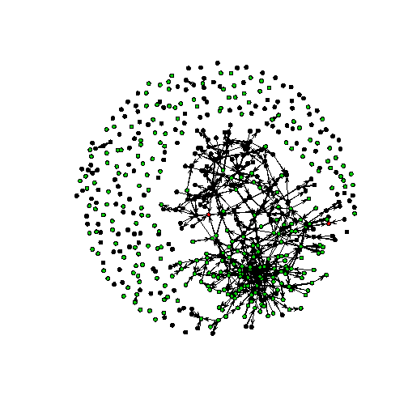
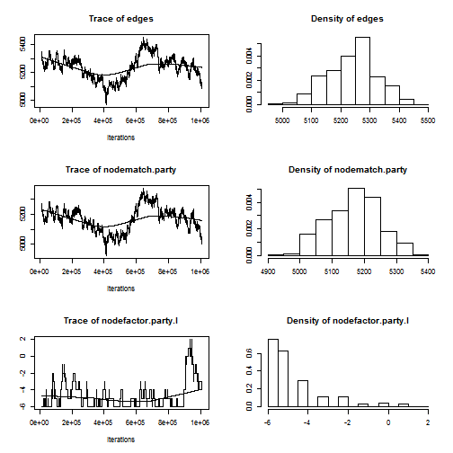
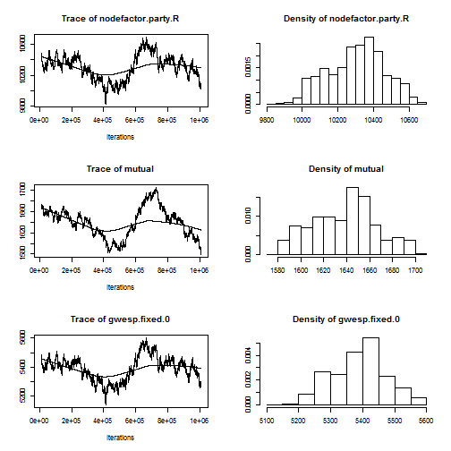

ERGM of U.S. congressmen's retweet networks
========================================================
# R script of ERGM
# chengjun wang @cmc, 2013 Dec 17th
# http://weblab.com.cityu.edu.hk/blog/project/workshops/


```r


######################### load data
setwd("E:/Github/ergm")
att = read.table("./party_info.txt", sep = ",", header = T, stringsAsFactors = F)
mat = as.matrix(read.table("./retweet_network.txt", header = TRUE, sep = ",", 
    row.names = 1, stringsAsFactors = F, as.is = TRUE))
table(att$party)  # democracy, independent, and republic.
```

```
## 
##   D   I   R 
## 251   2 274
```

```r

########################## build the network object 　since there is a conflict between igraph and
########################## statnet we need to detach igraph first before we call statnet

detach("package:igraph", unload = TRUE)
```

```
## Error: invalid 'name' argument
```

```r

library(statnet)
```

```
## Loading required package: network
## network: Classes for Relational Data
## Version 1.9.0 created on 2014-01-03.
## copyright (c) 2005, Carter T. Butts, University of California-Irvine
##                     Mark S. Handcock, University of California -- Los Angeles
##                     David R. Hunter, Penn State University
##                     Martina Morris, University of Washington
##                     Skye Bender-deMoll, University of Washington
##  For citation information, type citation("network").
##  Type help("network-package") to get started.
## 
## Loading required package: ergm
## Loading required package: statnet.common
## 
## ergm: version 3.1.2, created on 2014-01-30
## Copyright (c) 2014, Mark S. Handcock, University of California -- Los Angeles
##                     David R. Hunter, Penn State University
##                     Carter T. Butts, University of California -- Irvine
##                     Steven M. Goodreau, University of Washington
##                     Pavel N. Krivitsky, University of Wollongong
##                     Martina Morris, University of Washington
## Based on "statnet" project software (statnet.org).
## For license and citation information see statnet.org/attribution
## or type citation("ergm").
## 
## NOTE: If you use custom ERGM terms based on 'ergm.userterms'
## version prior to 3.1, you will need to perform a one-time update
## of the package boilerplate files (the files that you did not write
## or modify) from 'ergm.userterms' 3.1 or later. See
## help('eut-upgrade') for instructions.
## 
## NOTE: Dynamic network modeling functionality (STERGMs) has been
## moved to a new package, 'tergm'.
## 
## Loading required package: sna
## sna: Tools for Social Network Analysis
## Version 2.3-2 created on 2014-01-13.
## copyright (c) 2005, Carter T. Butts, University of California-Irvine
##  For citation information, type citation("sna").
##  Type help(package="sna") to get started.
## 
## 
## Attaching package: 'sna'
## 
## 下列对象被屏蔽了from 'package:network':
## 
##     %c%
## 
## Loading required package: networkDynamic
## 
## networkDynamic: version 0.6.3, created on 2014-02-27
## Copyright (c) 2014, Carter T. Butts, University of California -- Irvine
##                     Ayn Leslie-Cook, University of Washington
##                     Pavel N. Krivitsky, University of Wollongong
##                     Skye Bender-deMoll, University of Washington
##                     with contributions from
##                     Zack Almquist, University of California -- Irvine
##                     David R. Hunter, Penn State University
##                     Li Wang
##                     Kirk Li, University of Washington
##                     Steven M. Goodreau, University of Washington
##                     Martina Morris, University of Washington
## Based on "statnet" project software (statnet.org).
## For license and citation information see statnet.org/attribution
## or type citation("networkDynamic").
## 
## Loading required package: tergm
## 
## tergm: version 3.1.4, created on 2014-01-16
## Copyright (c) 2014, Pavel N. Krivitsky, University of Wollongong
##                     Mark S. Handcock, University of California -- Los Angeles
##                     with contributions from
##                     David R. Hunter, Penn State University
##                     Steven M. Goodreau, University of Washington
##                     Martina Morris, University of Washington
##                     Nicole Bohme Carnegie, New York University
##                     Carter T. Butts, University of California -- Irvine
##                     Ayn Leslie-Cook, University of Washington
##                     Skye Bender-deMoll
## Based on "statnet" project software (statnet.org).
## For license and citation information see statnet.org/attribution
## or type citation("tergm").
## 
## Loading required package: ergm.count
## 
## ergm.count: version 3.1.1, created on 2013-03-29
## Copyright (c) 2013, Pavel N. Krivitsky, University of Wollongong
##                     with contributions from
##                     Mark S. Handcock, University of California -- Los Angeles
##                     David R. Hunter, Penn State University
## Based on "statnet" project software (statnet.org).
## For license and citation information see statnet.org/attribution
## or type citation("ergm.count").
## 
## Loading required package: latentnet
## 
## latentnet: version 2.5.1, created on 2014-02-17
## Copyright (c) 2014, Pavel N. Krivitsky, University of Wollongong
##                     Mark S. Handcock, University of California -- Los Angeles
##                     with contributions from
##                     Susan M. Shortreed
##                     Jeremy Tantrum
##                     Peter D. Hoff
## Based on "statnet" project software (statnet.org).
## For license and citation information see statnet.org/attribution
## or type citation("latentnet").
## 
## 
## Attaching package: 'latentnet'
## 
## 下列对象被屏蔽了from 'package:base':
## 
##     scale
## 
## 
## statnet: version 2014.2.0, created on 2014-02-05
## Copyright (c) 2014, Mark S. Handcock, University of California -- Los Angeles
##                     David R. Hunter, Penn State University
##                     Carter T. Butts, University of California -- Irvine
##                     Steven M. Goodreau, University of Washington
##                     Pavel N. Krivitsky, University of Wollongong
##                     Skye Bender-deMoll
##                     Martina Morris, University of Washington
## Based on "statnet" project software (statnet.org).
## For license and citation information see statnet.org/attribution
## or type citation("statnet").
```

```r

# Create a network object out of the edgelist
n = network(mat, vertex.attr = NULL, vertex.attrnames = NULL, matrix.type = "adjacency", 
    directed = TRUE)
summary(n)  # see the basic info of the network.
```

```
## Network attributes:
##   vertices = 527
##   directed = TRUE
##   hyper = FALSE
##   loops = FALSE
##   multiple = FALSE
##   bipartite = FALSE
##  total edges = 426 
##    missing edges = 0 
##    non-missing edges = 426 
##  density = 0.001537 
## 
## Vertex attributes:
##   vertex.names:
##    character valued attribute
##    527 valid vertex names
## 
## No edge attributes
## 
## Network edgelist matrix:
##        [,1] [,2]
##   [1,]    7    2
##   [2,]   23    2
##   [3,]   26    2
##   [4,]   63    2
##   [5,]   77    3
##   [6,]   48    4
##   [7,]   60    4
##   [8,]  469    4
##   [9,]   62    8
##  [10,]   70    8
##  [11,]    2    9
##  [12,]    4    9
##  [13,]   63    9
##  [14,]  106    9
##  [15,]  260    9
##  [16,]    4   10
##  [17,]   75   10
##  [18,]  249   10
##  [19,]  434   10
##  [20,]   45   11
##  [21,]  446   11
##  [22,]  176   13
##  [23,]  360   15
##  [24,]  525   15
##  [25,]   48   18
##  [26,]  470   20
##  [27,]    4   22
##  [28,]   26   23
##  [29,]   53   23
##  [30,]   76   23
##  [31,]  342   25
##  [32,]  199   26
##  [33,]  241   26
##  [34,]  449   26
##  [35,]   26   27
##  [36,]   54   30
##  [37,]   61   30
##  [38,]    4   31
##  [39,]   26   33
##  [40,]   55   33
##  [41,]   23   36
##  [42,]   73   36
##  [43,]  527   36
##  [44,]    2   37
##  [45,]  511   40
##  [46,]   56   43
##  [47,]   36   45
##  [48,]    2   48
##  [49,]    4   48
##  [50,]   60   48
##  [51,]   65   48
##  [52,]   26   50
##  [53,]   14   52
##  [54,]   96   52
##  [55,]  187   52
##  [56,]   23   53
##  [57,]   71   53
##  [58,]   66   54
##  [59,]   87   54
##  [60,]  377   54
##  [61,]  488   54
##  [62,]  490   54
##  [63,]  313   55
##  [64,]   15   57
##  [65,]   30   57
##  [66,]   36   57
##  [67,]   73   57
##  [68,]   96   57
##  [69,]  501   58
##  [70,]  230   61
##  [71,]   65   62
##  [72,]    4   64
##  [73,]  303   64
##  [74,]  397   64
##  [75,]  213   65
##  [76,]  290   65
##  [77,]   77   66
##  [78,]  100   66
##  [79,]   66   68
##  [80,]  314   70
##  [81,]    4   73
##  [82,]   26   73
##  [83,]   36   73
##  [84,]   64   73
##  [85,]  434   75
##  [86,]  146   76
##  [87,]   36   77
##  [88,]   66   77
##  [89,]  339   77
##  [90,]  459   77
##  [91,]    1   79
##  [92,]    4   79
##  [93,]   26   81
##  [94,]   40   82
##  [95,]  202   82
##  [96,]  305   82
##  [97,]  342   85
##  [98,]   48   87
##  [99,]  100   89
## [100,]    4   92
## [101,]  191   96
## [102,]   61   97
## [103,]   26   99
## [104,]   66  100
## [105,]   73  100
## [106,]  269  100
## [107,]  313  100
## [108,]  370  100
## [109,]  446  105
## [110,]  153  106
## [111,]  179  110
## [112,]   95  111
## [113,]  506  114
## [114,]  412  118
## [115,]  142  121
## [116,]  235  121
## [117,]  319  121
## [118,]  261  122
## [119,]  320  125
## [120,]  331  125
## [121,]  172  126
## [122,]  191  126
## [123,]  515  128
## [124,]  290  131
## [125,]  268  135
## [126,]   96  142
## [127,]  114  142
## [128,]  199  142
## [129,]  204  142
## [130,]  297  142
## [131,]  299  142
## [132,]  375  142
## [133,]  377  142
## [134,]  381  142
## [135,]  392  142
## [136,]  397  142
## [137,]  465  142
## [138,]  481  142
## [139,]  495  142
## [140,]  501  142
## [141,]  377  146
## [142,]  142  151
## [143,]  260  154
## [144,]  191  156
## [145,]  495  162
## [146,]  304  164
## [147,]  146  166
## [148,]  513  166
## [149,]  482  167
## [150,]  240  171
## [151,]  122  172
## [152,]  304  174
## [153,]  257  178
## [154,]  106  184
## [155,]  142  184
## [156,]  388  192
## [157,]  417  192
## [158,]  122  194
## [159,]  229  194
## [160,]  296  194
## [161,]  339  194
## [162,]  347  194
## [163,]  272  195
## [164,]  289  195
## [165,]  412  195
## [166,]   24  196
## [167,]  458  203
## [168,]  153  204
## [169,]  515  206
## [170,]  249  209
## [171,]  513  209
## [172,]  514  209
## [173,]  359  211
## [174,]  313  212
## [175,]  320  212
## [176,]  296  213
## [177,]  359  213
## [178,]  213  216
## [179,]  490  216
## [180,]  320  217
## [181,]  336  217
## [182,]  355  217
## [183,]  331  220
## [184,]  249  223
## [185,]  142  224
## [186,]  506  228
## [187,]   67  229
## [188,]  179  229
## [189,]  261  229
## [190,]  305  229
## [191,]  524  229
## [192,]  501  233
## [193,]  153  239
## [194,]  249  239
## [195,]  297  239
## [196,]  465  239
## [197,]  501  239
## [198,]  513  239
## [199,]  352  241
## [200,]  254  249
## [201,]  320  251
## [202,]  167  261
## [203,]  506  267
## [204,]  488  268
## [205,]  167  271
## [206,]  447  271
## [207,]  267  275
## [208,]  374  275
## [209,]  465  275
## [210,]  334  281
## [211,]  495  281
## [212,]  506  281
## [213,]  303  289
## [214,]  412  289
## [215,]  191  290
## [216,]  254  292
## [217,]  326  293
## [218,]  176  294
## [219,]  370  299
## [220,]  257  301
## [221,]  318  301
## [222,]  449  301
## [223,]  460  301
## [224,]  495  301
## [225,]  366  302
## [226,]  254  303
## [227,]  527  304
## [228,]  388  305
## [229,]  142  307
## [230,]  167  312
## [231,]  506  313
## [232,]  180  314
## [233,]  259  314
## [234,]  320  314
## [235,]  489  314
## [236,]  106  319
## [237,]  114  319
## [238,]  171  319
## [239,]  204  319
## [240,]  239  319
## [241,]  241  319
## [242,]  292  319
## [243,]  324  319
## [244,]  337  319
## [245,]  374  319
## [246,]  428  319
## [247,]  495  319
## [248,]  360  320
## [249,]  524  320
## [250,]  176  325
## [251,]  258  325
## [252,]  424  325
## [253,]  484  325
## [254,]  153  326
## [255,]  378  326
## [256,]  453  327
## [257,]  513  329
## [258,]  369  331
## [259,]  482  331
## [260,]  290  336
## [261,]  106  337
## [262,]  319  337
## [263,]  370  337
## [264,]  397  342
## [265,]  495  342
## [266,]  302  347
## [267,]  122  349
## [268,]  261  349
## [269,]  309  349
## [270,]  331  349
## [271,]  371  349
## [272,]  275  355
## [273,]  319  356
## [274,]  382  356
## [275,]  466  356
## [276,]  106  358
## [277,]  261  359
## [278,]  482  359
## [279,]   15  360
## [280,]  488  360
## [281,]  320  363
## [282,]  320  366
## [283,]  331  369
## [284,]  410  375
## [285,]  449  375
## [286,]  495  375
## [287,]  506  375
## [288,]  506  376
## [289,]  142  377
## [290,]  239  377
## [291,]  488  377
## [292,]  290  383
## [293,]  525  383
## [294,]  501  385
## [295,]  527  385
## [296,]  524  387
## [297,]  320  388
## [298,]  417  388
## [299,]  459  388
## [300,]  482  388
## [301,]  489  388
## [302,]  224  390
## [303,]  375  392
## [304,]  470  392
## [305,]  516  392
## [306,]  320  396
## [307,]   64  397
## [308,]  153  397
## [309,]  375  397
## [310,]  377  397
## [311,]  434  397
## [312,]  299  398
## [313,]  303  398
## [314,]  340  398
## [315,]  370  398
## [316,]  488  401
## [317,]  320  407
## [318,]  489  407
## [319,]  331  408
## [320,]  142  410
## [321,]  162  410
## [322,]  244  410
## [323,]  249  410
## [324,]  326  410
## [325,]  375  410
## [326,]  382  410
## [327,]  390  410
## [328,]  475  410
## [329,]  495  410
## [330,]  514  410
## [331,]  516  410
## [332,]  443  411
## [333,]  118  412
## [334,]  114  416
## [335,]  388  417
## [336,]  465  418
## [337,]  153  419
## [338,]  176  426
## [339,]  495  426
## [340,]  183  427
## [341,]  114  428
## [342,]  142  428
## [343,]  319  428
## [344,]  356  428
## [345,]  488  428
## [346,]  495  428
## [347,]  513  428
## [348,]   75  434
## [349,]  397  434
## [350,]  320  438
## [351,]  149  439
## [352,]  259  446
## [353,]  314  446
## [354,]  368  446
## [355,]  398  446
## [356,]  446  447
## [357,]  375  449
## [358,]  458  450
## [359,]  495  452
## [360,]  514  452
## [361,]  327  453
## [362,]  327  458
## [363,]  446  458
## [364,]  482  461
## [365,]  375  462
## [366,]  171  463
## [367,]  375  465
## [368,]  434  465
## [369,]  513  465
## [370,]  495  469
## [371,]  293  472
## [372,]  107  473
## [373,]  114  473
## [374,]  397  473
## [375,]  465  473
## [376,]  478  473
## [377,]  488  473
## [378,]  495  480
## [379,]  309  482
## [380,]  212  489
## [381,]  331  489
## [382,]  388  489
## [383,]  149  490
## [384,]  366  490
## [385,]  388  490
## [386,]  413  490
## [387,]  453  490
## [388,]  459  490
## [389,]  142  495
## [390,]  249  495
## [391,]  281  495
## [392,]  326  495
## [393,]  374  495
## [394,]  375  495
## [395,]  428  495
## [396,]  452  495
## [397,]  511  495
## [398,]  516  495
## [399,]   28  498
## [400,]  235  500
## [401,]  289  500
## [402,]  487  500
## [403,]  508  500
## [404,]  153  501
## [405,]  375  501
## [406,]  495  501
## [407,]   20  508
## [408,]  370  508
## [409,]  166  513
## [410,]  209  513
## [411,]  254  513
## [412,]  511  513
## [413,]  326  514
## [414,]  397  514
## [415,]  481  523
## [416,]  506  523
## [417,]   15  525
## [418,]  154  525
## [419,]  286  525
## [420,]  288  525
## [421,]  320  525
## [422,]  331  525
## [423,]  333  525
## [424,]  357  525
## [425,]  411  525
## [426,]  482  525
```

```r
# network.vertex.names(n)

# Add the node attribues Note that: if the sequence of vertex names are
# different from its sequence in the attributes, we need to match the
# postion att$party[match(n%v%'vertex.names',att$id)]
set.vertex.attribute(n, "party", att$party)
# n%v%'party'= att$party # another way to set node attributes

# model plot
plot(n, displayisolates = T, vertex.col = "party", vertex.cex = 0.7)
```

 

```r

# set the colors
n %v% "color" = n %v% "party"
n %v% "color" = gsub("D", "red", n %v% "color")
n %v% "color" = gsub("R", "blue", n %v% "color")
n %v% "color" = gsub("I", "yellow", n %v% "color")
n %v% "size" = (degree(n) + 1)/5

set.seed(2014)
plot(n, displayisolates = F, vertex.col = "color", vertex.cex = "size")
```

 

```r
# learn more about gplot by searching: ?gplot

############### ergm

m1 = ergm(n ~ edges + nodematch("party") + nodefactor("party") + mutual + gwesp(fixed = T, 
    cutoff = 30), parallel = 10)
```

```
## Iteration 1 of at most 20: 
## Convergence test P-value: 0e+00 
## The log-likelihood improved by 15.56 
## Iteration 2 of at most 20: 
## Convergence test P-value: 6.6e-14 
## The log-likelihood improved by 0.3207 
## Iteration 3 of at most 20: 
## Convergence test P-value: 8e-225 
## The log-likelihood improved by 1.656 
## Iteration 4 of at most 20: 
## Convergence test P-value: 6.3e-71 
## The log-likelihood improved by 4.498 
## Iteration 5 of at most 20: 
## Convergence test P-value: 7.5e-51 
## The log-likelihood improved by 3.861 
## Iteration 6 of at most 20: 
## Convergence test P-value: 0e+00 
## The log-likelihood improved by 10.69 
## Iteration 7 of at most 20: 
## Convergence test P-value: 0e+00 
## The log-likelihood improved by 8.971 
## Iteration 8 of at most 20: 
## Convergence test P-value: 0e+00 
## The log-likelihood improved by 9.294 
## Iteration 9 of at most 20: 
## Convergence test P-value: 0e+00 
## The log-likelihood improved by 9.655 
## Iteration 10 of at most 20: 
## Convergence test P-value: 0e+00 
## The log-likelihood improved by 9.934 
## Iteration 11 of at most 20: 
## Convergence test P-value: 0e+00 
## The log-likelihood improved by 9.791 
## Iteration 12 of at most 20: 
## Convergence test P-value: 0e+00 
## The log-likelihood improved by 10.54 
## Iteration 13 of at most 20: 
## Convergence test P-value: 0e+00 
## The log-likelihood improved by 11.36 
## Iteration 14 of at most 20: 
## Convergence test P-value: 0e+00 
## The log-likelihood improved by 11.49 
## Iteration 15 of at most 20: 
## Convergence test P-value: 0e+00 
## The log-likelihood improved by 12.22 
## Iteration 16 of at most 20: 
## Convergence test P-value: 0e+00 
## The log-likelihood improved by 12.02 
## Iteration 17 of at most 20: 
## Convergence test P-value: 0e+00 
## The log-likelihood improved by 12.47 
## Iteration 18 of at most 20: 
## Convergence test P-value: 0e+00 
## The log-likelihood improved by 12.79 
## Iteration 19 of at most 20: 
## Convergence test P-value: 0e+00 
## The log-likelihood improved by 13.09 
## Iteration 20 of at most 20: 
## Convergence test P-value: 0e+00 
## The log-likelihood improved by 13.28 
## 
## This model was fit using MCMC.  To examine model diagnostics and check for degeneracy, use the mcmc.diagnostics() function.
```

```r

# this take a long time!

summary(m1)
```

```
## 
## ==========================
## Summary of model fit
## ==========================
## 
## Formula:   n ~ edges + nodematch("party") + nodefactor("party") + mutual + 
##     gwesp(fixed = T, cutoff = 30)
## 
## Iterations:  20 
## 
## Monte Carlo MLE Results:
##                    Estimate Std. Error MCMC % p-value    
## edges               -7.9079     0.0806      0  <1e-04 ***
## nodematch.party      1.2851     0.1026      0  <1e-04 ***
## nodefactor.party.I  -0.1337     0.6844      0  0.8451    
## nodefactor.party.R   0.1641     0.0616      0  0.0078 ** 
## mutual               3.5576     0.0738      0  <1e-04 ***
## gwesp.fixed.0        2.5608     0.0979      0  <1e-04 ***
## ---
## Signif. codes:  0 '***' 0.001 '**' 0.01 '*' 0.05 '.' 0.1 ' ' 1
## 
##      Null Deviance: 384284  on 277202  degrees of freedom
##  Residual Deviance:   5877  on 277196  degrees of freedom
##  
## AIC: 5889    BIC: 5953    (Smaller is better.)
```

```r
mcmc.diagnostics(m1)
```

```
## Sample statistics summary:
## 
## Iterations = 10000:1009900
## Thinning interval = 100 
## Number of chains = 1 
## Sample size per chain = 10000 
## 
## 1. Empirical mean and standard deviation for each variable,
##    plus standard error of the mean:
## 
##                        Mean     SD Naive SE Time-series SE
## edges               5239.68  84.11   0.8411         27.722
## nodematch.party     5166.96  79.64   0.7964         26.495
## nodefactor.party.I    -4.68   1.62   0.0162          0.419
## nodefactor.party.R 10303.97 158.45   1.5845         52.842
## mutual              1638.88  27.99   0.2799         13.815
## gwesp.fixed.0       5389.43  83.09   0.8309         28.473
## 
## 2. Quantiles for each variable:
## 
##                     2.5%   25%   50%   75% 97.5%
## edges               5079  5177  5249  5293  5398
## nodematch.party     5020  5110  5173  5219  5319
## nodefactor.party.I    -6    -6    -5    -4     0
## nodefactor.party.R 10007 10190 10319 10414 10589
## mutual              1589  1617  1643  1657  1694
## gwesp.fixed.0       5237  5330  5397  5443  5553
## 
## 
## Are sample statistics significantly different from observed?
##            edges nodematch.party nodefactor.party.I nodefactor.party.R
## diff.       5240            5167         -4.676e+00              10304
## test stat.   189             195         -1.117e+01                195
## P-val.         0               0          5.875e-29                  0
##            mutual gwesp.fixed.0 Overall (Chi^2)
## diff.      1638.9        5389.4              NA
## test stat.  118.6         189.3           48960
## P-val.        0.0           0.0               0
## 
## Sample statistics cross-correlations:
##                      edges nodematch.party nodefactor.party.I
## edges              1.00000         0.98344            0.02823
## nodematch.party    0.98344         1.00000           -0.01491
## nodefactor.party.I 0.02823        -0.01491            1.00000
## nodefactor.party.R 0.98317         0.98655            0.02232
## mutual             0.82052         0.84793           -0.15685
## gwesp.fixed.0      0.98614         0.97923            0.02744
##                    nodefactor.party.R  mutual gwesp.fixed.0
## edges                         0.98317  0.8205       0.98614
## nodematch.party               0.98655  0.8479       0.97923
## nodefactor.party.I            0.02232 -0.1568       0.02744
## nodefactor.party.R            1.00000  0.8353       0.98773
## mutual                        0.83529  1.0000       0.81990
## gwesp.fixed.0                 0.98773  0.8199       1.00000
## 
## Sample statistics auto-correlation:
## Chain 1 
##          edges nodematch.party nodefactor.party.I nodefactor.party.R
## Lag 0   1.0000          1.0000             1.0000             1.0000
## Lag 100 0.9982          0.9981             0.9969             0.9982
## Lag 200 0.9964          0.9962             0.9938             0.9964
## Lag 300 0.9946          0.9944             0.9908             0.9947
## Lag 400 0.9929          0.9926             0.9879             0.9931
## Lag 500 0.9913          0.9909             0.9850             0.9914
##         mutual gwesp.fixed.0
## Lag 0   1.0000        1.0000
## Lag 100 0.9992        0.9982
## Lag 200 0.9984        0.9963
## Lag 300 0.9975        0.9946
## Lag 400 0.9967        0.9929
## Lag 500 0.9959        0.9912
## 
## Sample statistics burn-in diagnostic (Geweke):
## Chain 1 
## 
## Fraction in 1st window = 0.1
## Fraction in 2nd window = 0.5 
## 
##              edges    nodematch.party nodefactor.party.I 
##            0.27697            0.30501           -0.64546 
## nodefactor.party.R             mutual      gwesp.fixed.0 
##            0.18485            0.71331            0.09087 
## 
## P-values (lower = worse):
##              edges    nodematch.party nodefactor.party.I 
##             0.7818             0.7604             0.5186 
## nodefactor.party.R             mutual      gwesp.fixed.0 
##             0.8533             0.4757             0.9276
```

```
## Loading required package: latticeExtra
```

```
## Warning: there is no package called 'latticeExtra'
```

```
## Package latticeExtra is not installed. Falling back on coda's default MCMC diagnostic plots.
```

  


